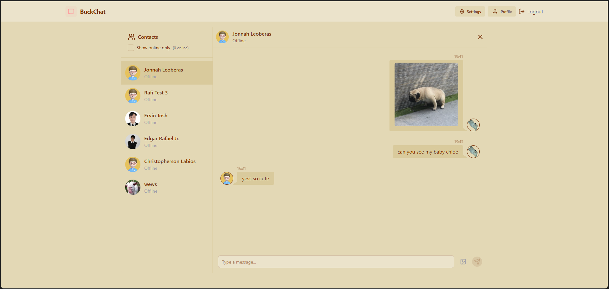
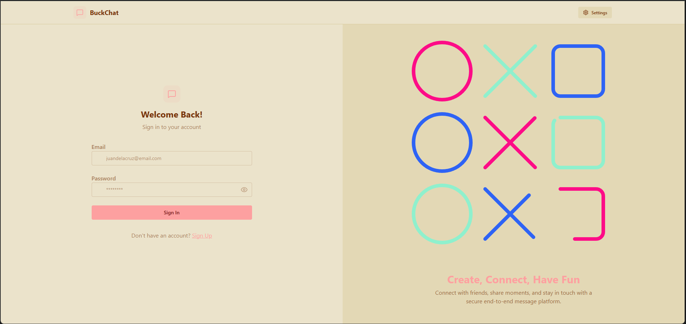

<div align="center">

# BuckChat

### A Real-Time MERN Fullstack Chat Application

[](https://buckchat.onrender.com/login)
[](LICENSE)
[](CONTRIBUTING.md)

[Features](#-features) • [Demo](#-demo) • [Tech Stack](#-tech-stack) • [Getting Started](#-getting-started) • [Architecture](#-architecture) • [Contributing](#-contributing)

</div>

---

## 📖 Overview

BuckChat is a production-ready, full-stack chat application that brings the power of real-time communication.

### Why BuckChat?

- **🚀 Real-Time Performance**: WebSocket-based architecture ensures instant message delivery
- **🔒 Secure by Design**: End-to-end encryption keeps your conversations private
- **⚡ Low Latency**: Optimized for high-performance communication
- **🌐 Highly Available**: Built for reliability and scalability

---

## ✨ Features

### Core Messaging
- 💬 **One-to-One Messaging** - Private conversations with real-time delivery
- 👥 **Group Chat** - Create and manage group conversations
- ✅ **Read Receipts** - Know when your messages are seen
- 📜 **Chat History** - Access your complete conversation history
- 🔔 **Real-Time Notifications** - Browser notifications on web, native on Android

### Advanced Features
- 📸 **Media Sharing** - Send and receive photos and videos
- 🟢 **Online Status** - See who's available in real-time
- 🔐 **End-to-End Encryption** - Military-grade message security
- ☁️ **Scalable Storage** - Efficient BLOB storage for media files

---

## 🎬 Demo

**Live Application**: [https://buckchat.onrender.com/login](https://buckchat.onrender.com/login)

### Screenshots

<div align="center">

| Chat Interface | Authentication Interface |
|:---:|:---:|
|  |  |

</div>

---

## 🛠️ Tech Stack

### Frontend
- **Framework**: React.js / React Native
- **State Management**: Redux / Context API
- **Styling**: Tailwind CSS / Styled Components
- **Real-Time**: Socket.io Client

### Backend
- **Runtime**: Node.js
- **Framework**: Express.js
- **Real-Time**: Socket.io
- **Database**: MongoDB 
- **Authentication**: JWT
- **Storage**: Cloudinary

### Infrastructure
- **Hosting**: Render
- **CI/CD**: GitHub Actions

---

## 🚀 Getting Started

### Prerequisites

Before you begin, ensure you have the following installed:
- Node.js (v16 or higher)
- npm or yarn
- MongoDB 
- Git

### Installation

1. **Clone the repository**
```bash
git clone https://github.com/rafisaiyari/chatapp.git
cd chatapp
```

2. **Install dependencies**
```bash
# Install backend dependencies
cd backend
npm install

# Install frontend dependencies
cd ../frontend
npm install
```

3. **Environment Configuration**

Create `.env` files in backend directory:

**Backend `.env`**
```env
PORT=5001
NODE_ENV=development
MONGODB_URI=your_mongodb_connection_string
JWT_SECRET=your_jwt_secret
SOCKET_PORT=5001
CLOUDINARY_CLOUD_NAME=your_cloudinary_cloud_name
CLOUDINARY_API_KEY=your_cloudinary_API_key
CLOUDINARY_API_SECRET=your_cloudinary_API_secret
```

4. **Start the application**

```bash
# Start backend server
cd backend
npm run dev

# In a new terminal, start frontend
cd frontend
npm start
```

The application will be available at(production):
(http://localhost:5173/)

---

## 📁 Project Structure

```
chatapp/
├── backend/
|   ├── src/
│       ├── controllers/     # Route controllers
│       ├── lib/             # Configs for APIs
│       ├── middleware/      # Custom middleware
│       ├── models/          # Database models
│       ├── routes/          # Auth and Message routes
│       └── index.js         # Entry point
|   
├── frontend/
│   ├── public/              # Static files
│   ├── src/
│   │   ├── components/      # React components
│   │   |   ├── skeletons/   # Skeletons
│   │   ├── pages/           # Page components
│   │   ├── lib/             # Utils and Axios
│   │   ├── constants/       # Themes
│   │   ├── store/           # Stores
│   └── package.json
└── README.md
```

---

## 🏗️ Architecture

### System Architecture

```
┌─────────────┐         ┌─────────────┐         ┌─────────────┐
│   Client    │◄───────►│   API       │◄───────►│  Database   │
│  (React)    │         │  Gateway    │         │  (MongoDB)  │
└─────────────┘         └─────────────┘         └─────────────┘
       │                       │
       │                       │
       ▼                       ▼
┌─────────────┐         ┌─────────────┐
│  WebSocket  │◄───────►│   Media     │
│   Server    │         │  Storage    │
└─────────────┘         └─────────────┘
```

### Key Technical Decisions

**WebSocket Communication**
- Real-time bidirectional communication for instant messaging
- Room-based architecture for efficient group messaging
- Automatic reconnection with exponential backoff

**Database Design**
- User authentication and profile management
- Message storage with indexing for fast retrieval
- Media metadata with references to cloud storage

**Security Measures**
- JWT-based authentication
- End-to-end encryption for messages
- Rate limiting on API endpoints
- Input validation and sanitization

---

## 🔧 Configuration

### Database Setup

**MongoDB**
```bash
# Start MongoDB locally
mongod --dbpath /path/to/data

# Or use MongoDB Atlas for cloud hosting
```

## 🧪 Testing

```bash
# Run backend tests
cd backend
npm test

# Run frontend tests
cd frontend
npm test

# Run end-to-end tests
npm run test:e2e
```

---

## 📦 Deployment

### Deploy to Render

1. Connect your GitHub repository to Render
2. Configure environment variables in Render dashboard
3. Deploy backend and frontend as separate services
4. Update frontend `.env` with production API URL

## 🤝 Contributing

We welcome contributions from the community! Here's how you can help:

1. **Fork the repository**
2. **Create a feature branch**: `git checkout -b feature/amazing-feature`
3. **Commit your changes**: `git commit -m 'Add amazing feature'`
4. **Push to the branch**: `git push origin feature/amazing-feature`
5. **Open a Pull Request**

---

## 🗺️ Roadmap

### Planned Features
- [ ] Voice messages
- [ ] Message reactions (👍 ❤️ 😂)
- [ ] Emoji picker for messages
- [ ] Message search functionality
- [ ] Video calling
- [ ] File sharing (documents, PDFs)
- [ ] Group Chats


Want to help build any of these features? Check out our [Contributing Guide](#-contributing)!

---

## 📝 API Documentation

### Authentication

**POST** `/api/auth/register`
```json
{
  "username": "string",
  "email": "string",
  "password": "string"
}
```

**POST** `/api/auth/login`
```json
{
  "email": "string",
  "password": "string"
}
```

### Messages

**GET** `/api/messages/:chatId`
- Retrieves messages for a specific chat

**POST** `/api/messages`
```json
{
  "chatId": "string",
  "content": "string",
  "type": "text|image|video"
}
```

## 🔒 Security

- **Encryption**: All messages are encrypted end-to-end
- **Authentication**: JWT-based secure authentication
- **Input Validation**: All inputs are sanitized and validated
- **Rate Limiting**: API endpoints are rate-limited to prevent abuse
- **CORS**: Configured to accept requests only from trusted origins

To report security vulnerabilities, please email: security@buckchat.com

---

## 📄 License

This project is licensed under the MIT License - see the [LICENSE](LICENSE) file for details.

---

## 👥 Authors

- **Rafi Saiyari** - *Initial work* - [@rafisaiyari](https://github.com/rafisaiyari)

See also the list of [contributors](https://github.com/rafisaiyari/chatapp/contributors) who participated in this project.

---

## 🙏 Acknowledgments

- Socket.io for real-time communication
- WebRTC for video calling capabilities
- MongoDB for reliable data storage
- The open-source community for inspiration

---

## 📞 Support

- **Documentation**: [Wiki](https://github.com/rafisaiyari/chatapp/wiki)
- **Issues**: [GitHub Issues](https://github.com/rafisaiyari/chatapp/issues)
- **Discussions**: [GitHub Discussions](https://github.com/rafisaiyari/chatapp/discussions)
- **Email**: rafisaiyari0814@gmail.com

---

<div align="center">

**[⬆ back to top](#-buckchat)**

Made with ❤️

</div>
